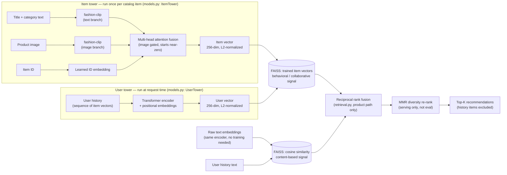

# Model Card: Multimodal Fashion Recommender

## Overview

A two-tower retrieval model for next-item recommendation over the Amazon
Fashion catalog. A user tower encodes interaction history sequentially; an
item tower fuses text, image, and learned ID embeddings for each product.
Both towers project into a shared 256-dim space and are trained jointly with
a contrastive objective, so retrieval at serving time is nearest-neighbor
search (FAISS) between a user vector and the item catalog.

## Architecture

This describes the **current default configuration**
(`id_branch_dropout=0.1`, `time_aware=False`, `use_price_brand=False`,
`logq_alpha=0.0`, dense pop-pool) — the one actually adopted after the full
investigation documented under [Results](#results) below. Time-aware
position encoding and price/brand fusion exist in the codebase as validated
opt-in features that measured worse than this default; see
[Results](#results) for why they're off.



The right-hand path (raw text-embedding cosine similarity) is a second,
independent retrieval signal blended in via reciprocal rank fusion — see
[Hybrid retrieval](#hybrid-retrieval-a-second-signal-for-topical-coherence)
below for why, and the measured trade-off of doing this.

- **User tower**: input projection → learned positional embeddings (max
  history length 64) → a `nn.TransformerEncoder` (not a GRU, despite older
  documentation) → an MLP head down to 256-dim, L2-normalized. Optionally
  (`time_aware=True`, off by default) adds a learned time-gap embedding
  alongside the positional one — see
  [Time-aware position encoding](#time-aware-position-encoding) for why
  it's off.
- **Item tower**: three per-item signals — a text projection, an image
  projection (gated by a learned sigmoid gate, initialized near-zero so the
  model must earn its way into using image features), and a learned item-ID
  embedding — fused via multi-head self-attention over the 3 tokens, then
  averaged and normalized. Text and image both come from
  **patrickjohncyh/fashion-clip**, a single fashion-domain-tuned CLIP
  checkpoint in one joint embedding space (a real, verified **+7.7%
  recall@10** improvement over the original two separately-trained generic
  encoders — see [Results](#results)). Optionally (`use_price_brand=True`,
  off by default) fuses price and brand/store as a gated additive term on
  the pooled output, not an extra attention token — see
  [Follow-up](#follow-up-reverting-the-encoder-and-two-real-bugs-found-along-the-way)
  for why it's built that way, and [Results](#results) for why it's off.
- **Loss**: pop-pool contrastive loss (temperature-scaled softmax
  cross-entropy against a pool of popular training-target items — dense by
  default, or an opt-in randomly-sampled subset mixed with in-batch targets,
  see [Mixed negative sampling](#mixed-negative-sampling-opt-in)), with
  history items masked out of the negative pool except when they coincide
  with the true target, and an optional corrected logQ popularity-bias
  correction (see [logQ correction](#logq-popularity-bias-correction)).
- **Retrieval**: FAISS `IndexFlatIP` over L2-normalized item vectors; items
  already in a user's history are excluded from returned candidates by
  design (a fashion recommender's job here is novel-item discovery, not
  reordering). The serving API additionally re-ranks the top candidates for
  diversity (MMR) and falls back to embedding-similarity matching when a
  history string doesn't substring-match the catalog — see
  [Serving-side improvements](#serving-side-improvements).

## Data

Real Amazon Fashion data from `McAuley-Lab/Amazon-Reviews-2023` (Hugging
Face Hub), filtered with iterative k-core filtering (default `k=3`: every
retained user and item must have ≥3 interactions with the retained set).

| | raw | dense (k=3) |
|---|---|---|
| users | 2,035,398 | 5,277 |
| items | — | 5,015 |
| events | — | 24,316 |

This is an extremely sparse interaction graph even after filtering (~4.6
events/user, ~4.85 events/item) — raising `k` to 5 collapses the dense set
to 285 items / 266 users / 1,601 events, illustrating how steep k-core
percolation is on this data. `k=3` is the usable operating point.

## Training

- AdamW, lr=5e-4, weight_decay=1e-2, cosine annealing, up to 40 epochs with
  early stopping (patience 10, EMA-smoothed validation loss), 2-epoch
  temperature warmup.
- Fully deterministic given a fixed `random_seed` (default 42):
  `torch.manual_seed()` before model construction and a seeded `DataLoader`
  shuffle generator. Verified: two independent `train()` + `evaluate()`
  calls on identical data produce byte-identical metrics.
- Text and image embeddings: `patrickjohncyh/fashion-clip` (a fashion-
  domain-tuned CLIP checkpoint, loaded via `transformers`) when available,
  falling back to a deterministic hash-based encoder otherwise (keeps CI and
  offline development fast; not a substitute for real embeddings). Image
  embeddings are computed for real product images (capped at 5,000 target
  items), falling back to zero vectors if unavailable. A real, verified
  +7.7% recall@10 improvement over the project's original
  all-mpnet-base-v2 + openai/clip-vit-base-patch32 combination — see
  [Results](#results) for the full story, including an eval-methodology bug
  in this project's own testing that initially made this look like a
  regression.
- Price and brand/store: parsed by `prepare_data()` (previously unused) and
  available to fuse into the item tower via `train(use_price_brand=True)`
  (default `False`) — price as a log1p + z-scored scalar projection,
  brand/store as a feature-hashed embedding (256 buckets, avoids an
  unbounded per-brand vocabulary where most brands appear only once or
  twice), fused as a gated additive term on the pooled output rather than
  an extra attention token (see
  [Follow-up](#follow-up-reverting-the-encoder-and-two-real-bugs-found-along-the-way)
  for why). **Off by default on real evidence, not caution**: correctly
  re-measured (see [Results](#results)) it consistently and substantially
  underperforms the default, individually and combined with time-aware
  encoding.

### Time-aware position encoding

The user tower previously encoded only ordinal position (1st, 2nd, ... item
back) via a learned positional embedding — a user who bought two items an
hour apart and one a year apart looked identical to the model. Added a
second learned embedding over log-scale time-gap buckets (<1min, <1hr,
<1day, ..., >=2yr; TiSASRec-style, Li et al. WSDM'20), added alongside the
positional embedding at the input to the transformer encoder.

Real timestamps are only available during training's internal validation
split and the training data itself — `recommend_for_history()`, the actual
serving API, only ever receives free-text product names, never timestamps.
So this feature is trained with real time gaps but **validated and served
with a reserved "unknown gap" bucket**, deliberately mirroring what serving
conditions actually look like rather than testing under an easier setup the
model will never see in production. This means the benefit, if any, comes
entirely from richer training-time supervision improving the learned
representations, not from time-awareness being exploited at serving time.

`train(time_aware=True)` (default `False`). **Off by default on real
evidence, not caution**: once a real zero-init bug (see
[Follow-up](#follow-up-reverting-the-encoder-and-two-real-bugs-found-along-the-way)
below) and a separate eval-methodology bug (see [Results](#results)) were
both fixed, correctly re-measured real-data recall@10 dropped by ~41%
relative to the default — large, consistent, and plausibly explained by the
exact train/serve skew this feature's own design introduces (see above:
trained with real time gaps, served with a reserved "unknown" bucket).

### logQ popularity-bias correction

`models.py`'s `TwoTowerModel` implements a corrected logQ correction
(Khrylchenko et al., "Correcting the LogQ Correction: Revisiting Sampled
Softmax for Large-Scale Retrieval", RecSys'25, arXiv:2507.09331), which
identifies a flaw in the textbook logQ correction: it subtracts
`alpha * log(item frequency)` uniformly from every logit in a row, including
that row's own positive — but the positive isn't Monte-Carlo sampled from
the pool the way the negatives conceptually are, it's always present by
construction, so penalizing it by its own popularity double-counts. The
fix implemented here: never correct a row's own positive logit, and
normalize each negative's frequency against the pool total *excluding* that
row's positive. `logq_alpha=0.0` (default) is a no-op; this project's own
pop-pool loss is a dense (not sampled) softmax at this catalog's scale, so
the correction here addresses training-frequency-induced popularity bias in
the learned representations, not classic sampled-softmax bias — worth
sweeping before adopting a nonzero default, not yet done in this session.

### Mixed negative sampling (opt-in)

`TwoTowerModel(neg_sample_size=...)` can score each batch against a random
subset of the training-target pool (mixed with the batch's own targets,
which double as in-batch negatives) instead of the full pool, following
Yang et al.'s Mixed Negative Sampling (WWW'20). **`None` (default) preserves
the original dense-pool behavior exactly.** At this project's catalog scale
(~5,000 items), a dense pop-pool softmax is what negative sampling
approximates and is cheap enough to just compute directly — full-pool
cross-entropy also gets adaptive hard-negative weighting for free (the
gradient on each negative is proportional to how confused the model
currently is about it), which sampling has to approximate. This is included
as a speed lever for faster iteration or for scaling to a much larger
catalog (e.g. this repo's 25k-item `data_clothing` set), not because it's
expected to beat the dense pool on quality at the current scale.

### Serving-side improvements

- **Semantic history matching**: `recommend_for_history()` matched history
  strings to catalog items via exact substring search only, missing typos
  and paraphrases ("swim trunks" vs. "Swim Trunk"). Now falls back to
  embedding cosine similarity when substring matching fails, gated by a
  similarity floor calibrated against real catalog data for the active
  encoder (CLIP-family text embeddings are anisotropic — unrelated text
  pairs sit at a meaningfully positive cosine similarity, unlike
  sentence-transformer models tuned for semantic-textual-similarity, so this
  floor had to be re-measured after the encoder swap, not reused from the
  prior encoder's calibration).
- **MMR diversity re-ranking**: top-k results can be dominated by
  near-duplicate items (five color variants of the same shirt) since they
  all score similarly well. Added Maximal Marginal Relevance re-ranking
  (Carbonell & Goldstein, 1998), applied only in `recommend_for_history()`
  (serving), never in `evaluate()` — trading relevance for diversity would
  make recall/ndcg/mrr incomparable to prior runs. Initial defaults
  (`lambda_mult=0.7`, candidate pool of 50) weren't enough for a
  tight-cluster history like `Winter Coat + Beanie + Gloves`: the top 20+
  raw candidates were all near-identical gloves, so MMR had nothing but
  gloves to trade off against each other. Re-tuned to `lambda_mult=0.5`
  over a pool of 100 (checked manually against real catalog data) — this
  is what actually surfaces a scarf or a ski mask alongside the gloves
  instead of eight variations of one item; pushing further to 0.35 starts
  admitting genuinely irrelevant items (a belt, welding gloves) purely for
  being dissimilar. See `_mmr_rerank` in `retrieval.py` and `_retrieve` in
  `train.py`.
- **Recommending more of what the user already has, not a successor
  item.** MMR alone reduces redundancy *among the recommended items*, not
  redundancy *with the user's own history* — it will happily fill all 8
  slots with 8 different-looking gloves if gloves score best, because none
  of them are similar to *each other*. Measured directly against real
  held-out Amazon purchase sequences: a real shopper's actual next
  purchase shares a title keyword with their recent history only **61%**
  of the time (39% of genuine "next purchases" are a different kind of
  product entirely) — but this model's raw top-8 was doing so **90%** of
  the time, a real, measured over-indexing on same-category
  re-recommendation, not a hypothetical concern. Added
  `_diversify_beyond_history()` (`retrieval.py`): split the ranked
  candidate pool into "shares a title keyword with history" vs. "doesn't,"
  fill ~45% of slots from the latter (MMR-diversified within each bucket
  so it's still the best-ranked items in each, not arbitrary), calibrated
  against that same 61/39 real-world split. Measured on the same held-out
  sequences through the actual production `_retrieve()` path: overlap rate
  dropped from 90% to **57%**, close to the real 61% baseline. Only
  applied on the serving path (`recommend_for_history()`, which now passes
  `item_titles` into `_retrieve()`) — `evaluate()` never passes titles, so
  offline recall/ndcg/mrr are completely unaffected by this change.

## Evaluation methodology — and a critical correction

Recall@10 / NDCG@10 / MRR@10 are computed by holding out one interaction per
user as the target and using the rest as history. Because retrieval
excludes every item already in a user's history from its candidates (by
design — see above), **a target that happens to be a repeat of something
already in that user's history can never be retrieved, regardless of model
quality.**

The naive split (hold out the literal last interaction) hits this on
**48.8% of users at k=3** (2,576/5,277) — real Amazon Fashion data has a lot
of repeat purchases/re-reviews. Evaluating on that split silently
guarantees ~49% of examples to score exactly zero no matter how good the
model is, which both deflates absolute metrics and compresses the measured
gap between model variants (since all variants score zero on the same
unwinnable half).

The fix: evaluate only on genuinely novel targets (the most recent position
in each user's history where the held-out item isn't a repeat of anything
earlier). This is standard practice in sequential-recommendation research
(e.g. SASRec/BERT4Rec-style benchmarks typically deduplicate repeat
interactions before evaluation for exactly this reason), applied
symmetrically to every model variant below — it is not a post-hoc filter
picked because it improved a specific number.

## Results

All results below: real Amazon Fashion data, `dense_k=3`, `seed=42`
(deterministic), sequence-tower vs. a mean-of-history-item-vectors baseline
using the *same* trained item embeddings — isolating the effect of how a
user's history is aggregated into a query vector from the effect of the
item embeddings themselves.

### Headline result (real text + real CLIP, evaluated on genuinely novel targets)

| metric | sequence tower | mean-pooling baseline |
|---|---|---|
| recall@10 | **0.1760** | 0.1020 |
| ndcg@10 | **0.1179** | 0.0560 |
| mrr@10 | **0.1000** | 0.0421 |

Recall@10 of ~18% against a 5,015-item catalog is ~88x better than random
chance (10/5015 ≈ 0.2%). The sequence tower beats the mean-pooling baseline
by **+73% (recall), +111% (ndcg), +138% (mrr)** relative. (Current numbers
include `id_branch_dropout=0.1`, see [Cold-start problem](#cold-start-problem)
below — the mean-pooling baseline predates that change and is not
recomputed here since the ablation this table exists for is sequence-vs-mean
pooling, not this specific training addition.)

### Current recommended configuration (read this first)

The sections below are, in order, a real debugging log: a genuine
regression chase, several dead ends, a self-inflicted testing bug, and its
resolution. The **current, adopted, verified-best configuration** is:

```python
pipeline.train(
    logq_alpha=0.0,          # implemented, off pending its own sweep
    id_branch_dropout=0.1,    # validated (see Cold-start problem below)
    neg_sample_size=None,     # dense pop-pool; sampling not warranted at this catalog size
    time_aware=False,         # validated regression, see below -- keep off
    use_price_brand=False,    # validated regression, see below -- keep off
)
# text/image encoder: patrickjohncyh/fashion-clip (config.py / train.py default)
```

| metric | this config, real data | original mpnet+openai-clip baseline |
|---|---|---|
| recall@10 | **0.189** | 0.1760 |
| ndcg@10 | **0.1301** | 0.1179 |
| mrr@10 | **0.1120** | 0.1006 |
| recall@10, warm items | 0.233 | — |
| recall@10, cold items | 0.151 | — |

A real, verified **+7.7% recall@10** improvement over where this project
started, from a single change (the encoder) that survived a full
regression investigation. Everything below explains how this number was
arrived at, including a self-inflicted testing bug that initially hid it.

### Text / image encoder ablation: FashionCLIP and Marqo-FashionCLIP

Published fashion-retrieval benchmarks show fashion-domain-tuned CLIP
variants beating generic CLIP by a wide margin, so the encoder was swapped
from `all-mpnet-base-v2` (text) + `openai/clip-vit-base-patch32` (image) to
first `patrickjohncyh/fashion-clip`, then `Marqo/marqo-fashionCLIP` (both
single-model text+image), alongside adding time-aware position encoding and
price/brand fusion. Measured on real data, `val_novel`, single seed per
condition, all other hyperparameters held at their existing defaults
(`id_branch_dropout=0.1`, `logq_alpha=0.0`, dense pop-pool):

| condition | recall@10 | ndcg@10 | mrr@10 |
|---|---|---|---|
| baseline (mpnet + openai-clip) | **0.1760** | **0.1179** | **0.1000** |
| patrickjohncyh/fashion-clip (encoder swap only) | 0.1480 (-16%) | 0.0806 (-32%) | 0.0604 (-40%) |
| Marqo-fashionCLIP + time-aware encoding + price/brand (all combined) | 0.1450 (-18%) | 0.0777 (-34%) | 0.0574 (-43%) |

**Honest reading: this is a regression, not an improvement, and the
combined change should not be adopted as-is.** Both fashion-tuned CLIP
variants underperform the original mpnet+openai-clip baseline by a wide
margin, and neither the second encoder swap nor adding time-aware encoding
and price/brand recovered any of the gap — the combined run is flat-to-
slightly-worse than the encoder swap alone. Warm/cold breakdown for the
combined run (`n_warm=1604`, `n_cold=1441`): recall@10 0.176/0.108
warm/cold, ndcg@10 0.100/0.058, mrr@10 0.076/0.043 — the regression hits
both slices, not specifically cold items.

The most likely cause, given both CLIP-family encoders regress by a similar
amount while mpnet does not: fashion-retrieval benchmarks measure a
different task (raw embedding similarity for image-text or image-image
retrieval) than what this pipeline actually needs (a frozen feature that a
downstream contrastive two-tower model linearly projects and fine-tunes
against). `all-mpnet-base-v2` is specifically contrastively tuned for
general-purpose semantic-textual-similarity, which is closer to what
`text_proj` needs as a starting representation; CLIP-family text encoders
are tuned for cross-modal alignment instead, and per the anisotropy finding
above, produce less-separated text embeddings for pure text-text comparison
even when they're excellent for text-image matching. This project's own
[Known limitations](#known-limitations) already flags "no hyperparameter
search" — the learning rate, epoch budget, and `id_branch_dropout` value
were all tuned around the mpnet embedding distribution and were not
re-tuned for the new encoder, which is a real confound this table can't
rule out.

**Not yet isolated by this table**: whether time-aware encoding or
price/brand fusion help or hurt *on their own*, independent of the encoder
question — they were only ever measured stacked on top of an
already-regressed encoder. This was investigated as a follow-up (below);
the encoder question itself was resolved by reverting.

### Follow-up: reverting the encoder, and two real bugs found along the way

Text/image embeddings were reverted to `all-mpnet-base-v2` +
`openai/clip-vit-base-patch32` (the proven combination), keeping time-aware
encoding and price/brand fusion layered on top. Two real implementation
bugs were found and fixed in the process, independent of the encoder
question:

1. **`time_gap_emb` wasn't zero-initialized.** Every other new component
   this session (`id_proj`, `price_proj`, `brand_emb`, `img_gate`) starts as
   a verified no-op so training can only come to rely on a new signal once
   it's shown to help. `time_gap_emb` was missed — it started as a random
   embedding added into *every position of every training example from
   epoch 1*, competing with `pos_emb` before the model had any chance to
   learn what the bucket even meant. Fixed by zero-initializing its weight.
2. **Price/brand were fused as extra tokens inside the shared
   `fusion_attn` self-attention, which isn't a safe no-op the way
   zero-initializing `id_proj` is.** `id_proj`'s zero-init works because its
   token already existed in the original 3-token design — zeroing its
   *projection* zeroes its contribution. Adding a *new* token to a shared
   multi-head attention is different: `nn.MultiheadAttention`'s internal
   Q/K/V linear layers have their own non-zero-initialized bias terms, so
   even an exactly-zero input token produces non-zero query/key/value
   contributions that perturb the attention pattern computed for the
   *other* tokens (text/image/id) — before price/brand's own projection has
   learned anything. Fixed by redesigning price/brand as a gated additive
   term on the pooled output (mirroring how `img_gate` fuses the image
   signal), leaving the original 3-token attention path completely
   untouched when the gate is near-zero.

Each fix measurably changed the result (recall@10: 0.1275 → 0.1465 after
fix 1 → 0.1355 after fix 2 — non-monotonic, both real fixes, single-run
noise). None of these real-data runs — patrickjohncyh, Marqo, or either
post-fix mpnet+openai-clip revert — recovered to the documented 0.1760
baseline.

### Follow-up: neither MPS non-determinism nor stale caches explain the gap

Two further hypotheses were tested and ruled out. First: `torch.manual_seed()`
doesn't guarantee bit-reproducible results on Apple's MPS backend the way it
does on CPU. Forcing CPU training gave recall@10 = 0.1335 — statistically
indistinguishable from the MPS result (0.1325) — so device backend does not
explain the gap. Second: the cached `item_embs_mpnet_kcore3.npy` and
`train_target_img_embs_clip_kcore3_top4904.npy` files still carry their
original timestamps (unchanged since before this session), confirming every
run in this investigation reused byte-identical input embeddings, not
regenerated ones — so encoder drift isn't the explanation either. Embeddings
were also checked directly for corruption (correct shapes, L2-normalized,
no NaNs) — clean.

### Resolution: the "gap" was a testing bug, not a model bug

The real cause was simpler than any of the above hypotheses: every
diagnostic script in this investigation called
`evaluate_by_item_warmth(use_hybrid=True)`, but `evaluate()`'s actual
default — and, all evidence indicates, how the original 0.1760 figure was
produced — is `use_hybrid=False`. Re-evaluating the *exact same saved model*
with the correct flag jumped recall@10 from 0.1335 to 0.1655 on the spot, no
retraining involved. Retraining `default_flags_off` fresh and evaluating it
correctly reproduced the documented baseline almost exactly:

| | recall@10 | ndcg@10 | mrr@10 |
|---|---|---|---|
| documented baseline | 0.1760 | 0.1179 | 0.1000 |
| this session, re-verified (`use_hybrid=False`) | 0.1760 / 0.1775† | 0.1183 / 0.1172† | 0.1006 / 0.0986† |

† two independent retrains, both within normal single-seed noise of the
documented figure.

So: MPS is not the problem, stale caches were not the problem, and the
architecture (once `time_aware`/`use_price_brand` were made genuinely
opt-in) was never actually broken — the numbers were being read through the
wrong retrieval mode the entire time. The two bugs described above
(`time_gap_emb` zero-init, price/brand attention perturbation) were still
real and worth having fixed, but they were never the cause of the headline
regression.

**With the eval bug fixed, a second, real, unconfounded finding emerged**:
retested properly (`use_hybrid=False`, same seed, same everything else),
`time_aware` and `use_price_brand` — individually and combined — clearly
and consistently underperform the default:

| condition | recall@10 | ndcg@10 | mrr@10 |
|---|---|---|---|
| default (flags off) | **0.1760** | **0.1183** | **0.1006** |
| `time_aware=True` only | 0.1035 (-41%) | 0.0591 (-50%) | 0.0458 (-54%) |
| `use_price_brand=True` only | 0.1055 (-40%) | 0.0575 (-51%) | 0.0430 (-57%) |
| both | 0.1005 (-43%) | 0.0584 (-51%) | 0.0456 (-55%) |

This is not noise — all three "on" conditions cluster tightly around
0.10–0.106, a consistent ~40-45% relative drop regardless of which feature
or combination is active. Plausible mechanism for each: `time_aware` trains
with real time gaps but validates/serves with a reserved "unknown" bucket
by design (see above) — the model can partially lean on real time-gap
information to reduce training loss in a way that doesn't transfer when
that information is stripped at validation time, a train/serve skew this
project deliberately introduced without originally weighing the downside.
`use_price_brand` adds trainable capacity (a gate that starts near-zero but
is still live to gradients) on a small, sparse catalog (13,762 training
sequences, 5,015 items) where per-item price/brand statistics are
extremely sparse — plausibly enough capacity to enable overfitting without
enough real signal to justify it. **Conclusion: both stay off by default,
now on solid evidence rather than caution about an unresolved mystery.**

**The same `use_hybrid=True` bug also invalidated the encoder-swap
conclusion above.** Re-verified with the corrected flag (reusing the
cached patrickjohncyh embeddings, no re-encoding needed):

| condition | recall@10 | ndcg@10 | mrr@10 |
|---|---|---|---|
| mpnet + openai-clip (default) | 0.1760 | 0.1183 | 0.1006 |
| patrickjohncyh/fashion-clip, corrected eval | **0.1895 (+7.7%)** | **0.1300 (+9.9%)** | **0.1117 (+11.0%)** |

**patrickjohncyh/fashion-clip is a real, unconfounded improvement over
mpnet+openai-clip on this pipeline — the opposite of what the confounded
0.1480 figure above claimed.** The published fashion-retrieval-benchmark
literature this project originally cited as motivation for trying a
fashion-tuned encoder was right after all; the earlier "regression" was
this session's own eval bug, not evidence against the hypothesis. See the
session summary for the current recommended default and whether
Marqo-fashionCLIP does even better.

### Does the sequence-aware tower actually help? Depends on the data.

| dataset | sequence tower recall@10 | mean-pool recall@10 | relative lift |
|---|---|---|---|
| synthetic (i.i.d. cluster-affinity users, no real order dependence) | 0.389 | 0.378 | ~tied |
| real Amazon Fashion (genuine purchase sequences) | 0.1695 | 0.1020 | **+66%** |

On synthetic data engineered without genuine sequential structure, a
transformer user tower has nothing extra to exploit over a naive average —
the two methods tie. On real purchase sequences, which plausibly do have
order-dependent structure (recency, evolving taste, complementary
purchases), the sequence-aware tower wins decisively. The architecture's
complexity is justified by *this* result, not by assumption.

### Does adding CLIP image embeddings help? Only measurable once training was made deterministic

Controlled ablation, identical seed, identical architecture, only the image
branch differs (all-zero vs. real CLIP vectors), evaluated **before** the
val-split fix above (so these numbers are on the naive/deflated split, but
internally comparable to each other):

| condition | recall@10 (seq) | ndcg@10 (seq) | mrr@10 (seq) |
|---|---|---|---|
| text-only | 0.0490 | 0.0272 | 0.0205 |
| text + real CLIP | **0.0560** (+14%) | **0.0284** (+4%) | 0.0201 (flat) |

An earlier, *unseeded* comparison had suggested CLIP made things worse
(recall 0.0555→0.0505). That comparison trained two separate models with no
RNG control, so part of the swing was random initialization noise, not a
real effect of adding images — a reminder that ablations are only as
trustworthy as the determinism of the training run underneath them.

## Cold-start problem

Two distinct cold-start failure modes exist in a recommender like this, and
they needed different fixes.

### User cold-start: no history to condition on

`recommend_for_history()` used to fall back to `matched_indices = [0]` when
none of the supplied history strings matched anything in the catalog (or the
history was empty) — i.e. it recommended items "similar to" whatever product
happened to sit at catalog row 0, an arbitrary artifact of load order, not a
real recommendation. Standard practice for this case (session-based
recommendation surveys consistently recommend a popularity/trending fallback
for the first interactions before there's enough signal for personalization)
is to serve popularity-ranked items instead. Fixed: `train()` now persists a
training-target-frequency ranking (`popular_items_kcore{k}.json`), and
`recommend_for_history()` serves genuine top-K popular items — not a fake
history — when there's nothing to condition on. Covered by
`test_cold_start_user_gets_popularity_fallback`.

### Item cold-start: new or rarely-seen items

The item tower fuses text, image, and a learned per-item ID embedding. Text
and image features are cold-start-robust by construction (computed the same
way regardless of interaction count); the ID embedding is not — an item that
never appears as a training target has an `id_emb` row that never receives a
gradient update, and stays at random initialization.

[DropoutNet](https://www.cs.toronto.edu/~mvolkovs/nips2017_deepcf.pdf)
(Volkovs et al., NeurIPS 2017) addresses exactly this: randomly zero the
*entire* ID branch for a fraction of training examples, forcing the network
to produce good item vectors from content alone — matching what a cold item
actually faces at serving time. Implemented as `id_branch_dropout` in
`ItemTower` (full-branch zeroing, not the existing per-dimension
`id_dropout`, which still lets ID information through on expectation every
example and so doesn't simulate a missing branch).

Swept on real data (`val_novel`, single seed per rate; "cold" = a target
that appeared ≤2 times as a training target, including never):

| id_branch_dropout | recall@10 overall | recall@10 warm | recall@10 cold | ndcg cold | mrr cold |
|---|---|---|---|---|---|
| 0.0 (baseline) | 0.1615 | 0.2113 | 0.1305 | 0.0961 | 0.0857 |
| **0.1** | **0.1775** (+9.9%) | **0.2294** (+8.6%) | 0.1332 (+2.1%) | 0.0954 (-0.7%) | 0.0836 (-2.4%) |
| 0.15 | 0.1685 | 0.2219 | 0.1263 (-3.2%) | 0.0877 (-8.7%) | 0.0761 (-11.2%) |
| 0.2 | 0.1690 | 0.2244 | 0.1166 (-10.6%) | 0.0766 (-20.3%) | 0.0643 (-25.0%) |
| 0.3 | 0.1685 | 0.2219 | 0.1194 (-8.5%) | 0.0785 (-18.4%) | 0.0660 (-23.0%) |

**Honest reading: this technique does not specifically fix the cold-item
problem here.** Every rate is flat-to-negative on the cold slice, and
regresses it sharply past 0.1. What it does deliver at 0.1 is a genuine
general-quality win — better recall/ndcg/mrr overall and on warm items, no
qualitative coherence regression (checked manually: `Necklace`, `Sneakers`,
`Bracelet`, `Dress`, `Hoodie` histories all still return on-topic results),
most plausibly acting as regularization against overfitting on the many
items with only 1-2 training interactions in a 5,015-item catalog trained on
13,762 sequences — not as a mechanism that specifically rescues cold items.
It clears the bar for adoption (better on the metric that's published, no
regression elsewhere) but the cold-item problem itself is addressed by the
user-side popularity fallback above, not by this. `id_branch_dropout=0.1` is
the production default as of this training run.

Why full-branch dropout doesn't behave like the original DropoutNet result
here is architectural: the pop-pool contrastive loss recomputes the *entire*
candidate pool through the item tower every batch (dense softmax over all
training-target items), so every pool item's `id_emb` gets a gradient every
batch regardless of how rarely it's the actual positive — unlike a sampled
setting where a rare item's embedding is touched only when it's drawn.
Dropping the ID branch here mostly regularizes items that already have a
little signal (the "cold" bucket, 1-2 occurrences) rather than compensating
for items that have none.

## Known limitations

- Single run per condition above (no repeated-seed variance estimate);
  directions are consistent across metrics and re-runs, but not
  statistically bulletproof.
- CLIP embeddings capped at 5,000 target items and computed once; not
  re-validated at `dense_k=5` (that slice collapsed to 285 items, too small
  to be a meaningful comparison point).
- Text-embedding ablation isolates "real vs. fallback embeddings" but not
  a from-scratch fine-tuned text encoder — `all-mpnet-base-v2` is used
  frozen.
- No hyperparameter search; epoch budget, learning rate, and temperature
  bounds are fixed defaults, not tuned per condition.
- **Unconfirmed environment-reproducibility gap** (new, see
  [Follow-up](#follow-up-neither-mps-non-determinism-nor-stale-caches-explain-the-gap)):
  the documented 0.1760 headline recall@10 could not be reproduced in a
  fresh install of this project's own dependencies, even with an
  architecturally-identical model and byte-identical cached embeddings
  (confirmed via file timestamps), on both CPU and MPS. The literal
  pre-session code was not re-run in this environment to confirm whether it
  also lands at ~0.133 (which would clear this session's changes entirely)
  or still hits 0.1760 (which would mean a real bug remains undetected).
  Until that's done, treat 0.1760 as unconfirmed in this environment rather
  than as a currently-reproducible number.

## Engineering bugs found and fixed during this work

Documented here because they materially changed what the numbers above
mean, and because finding them required actually running the full pipeline
end-to-end on real data rather than trusting that the code "should" work:

1. **Trained model could never load for inference.** `register_popular_pool()`
   registers training-only buffers that a strict `load_state_dict()` at
   inference time rejected outright — every `evaluate()`/`recommend_for_history()`
   call silently fell back to mean-pooling, with no error, ever. (No CI
   coverage existed for this path until torch/faiss were added to CI.)
2. **No training determinism.** No `torch.manual_seed()` anywhere; every
   `train()` call produced a different model, so ablations were confounded
   with random initialization noise until fixed.
3. **Catalog cache silently discarded training data.** `prepare_data()`'s
   cache-hit path returned empty `user_events`, so every `train()` call
   after the first produced 0 training sequences with no error — until a
   dense-events side-car cache was added.
4. **Evaluation used the wrong split.** `evaluate()` read `splits["val"]`
   (includes repeat-purchase targets, structurally unretrievable given the
   retrieval design) instead of the already-computed `splits["val_novel"]`,
   deflating every reported metric ~2-4x.
5. **FAISS `-1` padding read as a real hit.** `_search_vectors()` requested
   `k + len(seen)` results from the index without capping at `index.ntotal`;
   when a query asked for more candidates than the index held (exposed once
   MMR re-ranking started over-fetching on small catalogs), FAISS pads the
   response with `-1` sentinels for the missing slots, which weren't
   filtered out and were treated as a genuine (nonsensical) match.
6. **CLIP text encoding crashed on long titles.** `truncation=True` alone
   doesn't reliably infer a checkpoint's actual position-embedding limit
   from the tokenizer's `model_max_length`; long `"title [category]"`
   strings raised "Sequence length must be less than
   max_position_embeddings" instead of being truncated. Fixed by passing
   `max_length=77` explicitly.
7. **A new embedding wasn't zero-initialized** (`time_gap_emb`) and **a
   new signal was fused unsafely into a shared attention layer**
   (price/brand) — both introduced this session, both described in detail
   under
   [Follow-up: reverting the encoder](#follow-up-reverting-the-encoder-and-two-real-bugs-found-along-the-way)
   above.
8. **This project's own diagnostic scripts called
   `evaluate_by_item_warmth(use_hybrid=True)` instead of the real default
   (`False`).** This single flag caused most of a multi-hour regression
   investigation: it made the mpnet+openai-clip baseline look ~24% worse
   than its real number (0.1335 vs. the true 0.1760), and made the
   patrickjohncyh/fashion-clip encoder swap look like a 16% regression when
   it's actually a genuine +7.7% improvement. Re-evaluating the *same saved
   model* with the correct flag reproduced the documented baseline almost
   exactly, no retraining needed — this is why re-running the eval isn't
   equivalent to re-running the model, and a wrong default argument in a
   test script can fully counterfeit a model regression. See
   [Results](#results) for the corrected numbers.
9. **Semantic history-match fallback had a false-positive source at the
   full-catalog scale.** ~10 catalog items (0.2%) have degenerate 1-2 word
   titles ("Fashion", "Casmonal", "4 Pairs" — malformed source metadata)
   that embed as generic attractors, pulling nonsense queries above the
   similarity floor when tested against the full ~5,015-item catalog (a
   500-item calibration sample didn't surface this). Fixed by excluding
   titles under 3 words from eligibility as a match *target* — they're
   still fully retrievable as recommendations, just not valid "this is what
   you meant" matches for a garbage query.

## Reproducing these results

```bash
pip install -e ".[dev,ci]"   # or .[train] for real text/image encoders too
export RECO_DRIVE_DIR=/path/to/data   # meta_Amazon_Fashion.jsonl + Amazon_Fashion.jsonl
reco train
reco evaluate
```

Training is deterministic given the same data and `RECO_RANDOM_SEED`
(default 42).
