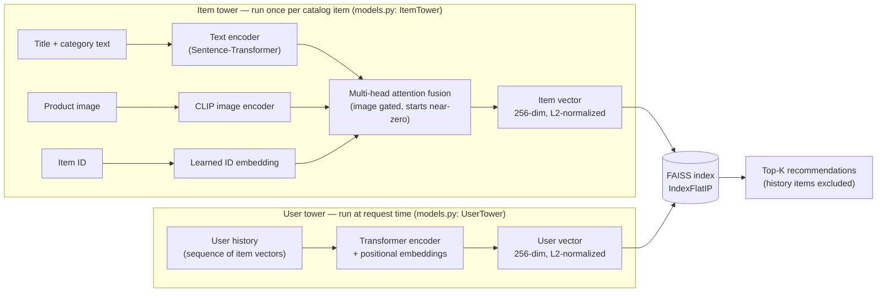

# Multimodal Fashion Recommender

A two-tower sequence-aware recommender for Amazon Fashion, trained and
evaluated on real Amazon Reviews 2023 data — not a toy dataset. A transformer
user tower encodes purchase history; an attention-fused item tower combines
text, image (CLIP), and learned ID embeddings. Served over a FastAPI +
Docker deployment, live on Hugging Face Spaces.

**Live demo:** https://huggingface.co/spaces/htinos/multimodal-fashion-recommender

```bash
curl -X POST https://htinos-multimodal-fashion-recommender.hf.space/recommend \
  -H "Content-Type: application/json" \
  -d '{"history": ["Swim Trunk", "Sunglasses"], "top_k": 5}'
```

**Full architecture, data, and results:** [MODEL_CARD.md](MODEL_CARD.md)

## Why this project is worth a look

Most portfolio recommenders stop at "here's an architecture and a metric."
This one is built around a harder, more useful claim: **the architecture's
added complexity earns its keep, and the numbers are honest.**

- **Trained on real data, not synthetic.** Amazon Fashion 2023 via the
  Hugging Face Hub, k-core filtered to a dense 5,015-item / 5,277-user
  subset out of 2M+ raw users.
- **Every architectural claim is backed by a controlled ablation, not
  assumed.** Sequence-aware retrieval vs. a mean-pooling baseline; real
  semantic embeddings vs. a deterministic fallback; real CLIP image
  embeddings vs. none — each measured with identical seeds, identical
  architecture, only one variable changed at a time. Result: the
  transformer user tower beats mean-pooling by **+66% relative recall@10**
  on real purchase sequences (and ties it on synthetic data with no genuine
  sequential structure — the model doesn't help when there's nothing for it
  to exploit, and the ablation shows that honestly instead of hiding it).
- **A real bug changed the headline number by ~3x.** The evaluation
  protocol was silently scoring ~49% of validation examples as guaranteed
  failures (repeat-purchase targets that the retrieval design structurally
  excludes) — full root cause and fix in the model card. Recall@10 went
  from 0.056 to 0.17 once fixed. That's the kind of bug that's invisible
  unless you actually run the full pipeline end-to-end on real data and
  question your own numbers, not just something a tutorial teaches you to
  check for.
- **Reproducible.** Deterministic training (`torch.manual_seed`, seeded
  DataLoader shuffling) — two independent runs on the same data produce
  byte-identical metrics.

## Results

Real Amazon Fashion data, `dense_k=3`, evaluated on genuinely novel targets
(see [MODEL_CARD.md](MODEL_CARD.md) for why that distinction matters):

| metric | sequence tower | mean-pooling baseline |
|---|---|---|
| recall@10 | **0.1695** | 0.1020 |
| ndcg@10 | **0.1132** | 0.0560 |
| mrr@10 | **0.0961** | 0.0421 |

Recall@10 of 17% against a 5,015-item catalog is ~85x better than random
chance (0.2%).

## Tech stack

**ML / modeling**
- [PyTorch](https://pytorch.org/) — two-tower model (transformer user tower, attention-fused item tower), training loop, mixed precision
- [Sentence-Transformers](https://www.sbert.net/) (`all-mpnet-base-v2`) — real semantic text embeddings
- Hugging Face [`transformers`](https://huggingface.co/docs/transformers) (CLIP ViT-B/32) — image embeddings
- [FAISS](https://github.com/facebookresearch/faiss) (`faiss-cpu`) — nearest-neighbor retrieval index
- NumPy / Pandas — k-core filtering, sequence construction, embedding math

**Data**
- [Hugging Face Hub](https://huggingface.co/docs/huggingface_hub) — dataset download
- [McAuley-Lab/Amazon-Reviews-2023](https://huggingface.co/datasets/McAuley-Lab/Amazon-Reviews-2023) — real Amazon Fashion metadata + reviews

**Backend / API**
- [FastAPI](https://fastapi.tiangolo.com/) — serving layer (`/health`, `/status`, `/recommend`), auto-generated OpenAPI docs at `/docs`
- [Uvicorn](https://www.uvicorn.org/) — ASGI server
- [Pydantic](https://docs.pydantic.dev/) / `pydantic-settings` — request/response validation, typed env-based config

**Frontend**
- Vanilla HTML/CSS/JavaScript — no framework, no build step, no dependencies — the `ui/` demo (see [Serving](#serving-fastapi--docker--ui))

**Infra / deployment**
- [Docker](https://www.docker.com/) + docker-compose — containerized serving
- [GitHub Actions](.github/workflows/ci.yml) — CI (lint + the *real* two-tower model and FAISS retrieval, not a stub)
- [Hugging Face Spaces](https://huggingface.co/docs/hub/spaces) (Docker SDK) — live deployment

**Dev tooling**
- [pytest](https://docs.pytest.org/) — fully offline synthetic-data fixture + integration tests
- [ruff](https://docs.astral.sh/ruff/) — linting
- [pre-commit](https://pre-commit.com/) — lint/format hooks
- [hatchling](https://hatch.pypa.io/) — packaging (`pyproject.toml`)

## How it works

**Offline — training** (`data.py`, `models.py`, `train.py`)

1. **Ingest** — download `meta_Amazon_Fashion.jsonl` / `Amazon_Fashion.jsonl` from the Hugging Face Hub.
2. **Densify** — iterative k-core filtering drops users/items with fewer than `k` interactions until convergence. On the real dataset this collapses **2,035,398 raw users down to a dense 5,277-user / 5,015-item subset**.
3. **Embed items** — each catalog item gets a text embedding (Sentence-Transformer, or a deterministic hash fallback if unavailable), a CLIP image embedding (computed for the top 5,000 most-frequent training targets), and a learned ID embedding.
4. **Build sequences** — each user's interaction history becomes training windows plus a held-out validation target — both a naive "last interaction" target and a *genuinely novel* one (`val_novel`), which the [model card](MODEL_CARD.md) explains is the one that's actually fair to evaluate on.
5. **Train** — the two-tower model trains against a temperature-scaled contrastive loss over a popularity pool of training-target items (AdamW, cosine annealing, early stopping on EMA-smoothed validation loss). Fully deterministic given a fixed seed.
6. **Index** — the trained item tower encodes the full catalog once; L2-normalized vectors are written to a FAISS `IndexFlatIP` index and saved to disk alongside the model checkpoint.

**Online — serving a request** (`api.py`, `retrieval.py`)

1. `POST /recommend` arrives with a list of history strings, e.g. `["Swim Trunk", "Sunglasses"]`.
2. Each string is matched to a catalog item by substring search over title/category.
3. The matched items' embeddings are run through the **already-trained** user tower (loaded once at process startup and reused across requests, not reloaded per call) to produce one query vector.
4. FAISS returns the nearest item vectors, excluding anything already in the supplied history.
5. Results (title, category, image URL, similarity score) come back as JSON, or get rendered directly as cards by the `ui/` frontend.

## Architecture



- **User tower:** transformer encoder (positional embeddings, multi-head
  self-attention) over interaction history → 256-dim vector.
- **Item tower:** text projection + CLIP image projection (learned sigmoid
  gate, starts near-zero) + learned item-ID embedding, fused via multi-head
  attention across the three signals.
- **Training:** temperature-scaled contrastive loss against a popularity
  pool, AdamW + cosine annealing, early stopping (see `train.py`).
- **Retrieval:** FAISS `IndexFlatIP` nearest-neighbor search (`retrieval.py`).

## Repository structure

```text
.
├── src/recommender/
│   ├── api.py          # FastAPI serving layer (/health, /status, /recommend)
│   ├── cli.py           # `reco` CLI (check, summary, train, evaluate)
│   ├── config.py        # Pydantic settings
│   ├── data.py           # Data download, k-core filtering, sequence construction
│   ├── models.py         # Two-tower architecture (user/item towers)
│   ├── retrieval.py       # FAISS retrieval + ranking metrics
│   ├── train.py           # Training/eval/recommend orchestration
│   ├── pipeline.py        # Public API re-export
│   └── logging_utils.py, utils.py
├── ui/                    # Static demo frontend (HTML/CSS/JS, no build step), served at /ui
├── scripts/               # train.py/evaluate.py entry points (equivalent to `reco train`/`evaluate`)
├── main.py                # Universal CLI entry point (equivalent to `reco`)
├── tests/                 # Fully offline synthetic-data fixture + integration tests
├── .github/workflows/ci.yml  # Lint + tests, including the real two-tower model + FAISS
├── Dockerfile, docker-compose.yml, Makefile
├── MODEL_CARD.md          # Architecture, data, training, results, limitations
└── pyproject.toml
```

## Quickstart

```bash
python -m venv .venv && source .venv/bin/activate
pip install -e ".[dev,ci]"        # add [train] instead of [ci] for real
                                    # sentence-transformers/CLIP encoders
cp .env.example .env               # optional: point RECO_DRIVE_DIR at your data
reco check                          # validate artifacts
pytest                               # fully offline, ~10s
```

Training needs `meta_Amazon_Fashion.jsonl` and `Amazon_Fashion.jsonl` from
[McAuley-Lab/Amazon-Reviews-2023](https://huggingface.co/datasets/McAuley-Lab/Amazon-Reviews-2023)
in `RECO_DRIVE_DIR` (auto-downloaded via the Hub if missing and `huggingface_hub`
is installed):

```bash
reco train
reco evaluate
```

```python
from recommender.pipeline import recommend_for_history

recommendations = recommend_for_history(["Swim Trunk", "Sunglasses", "Flip Flop"])
for rec in recommendations:
    print(rec)
```

## Serving (FastAPI + Docker + UI)

```bash
pip install -e ".[api]"
uvicorn recommender.api:app --host 0.0.0.0 --port 8000
```

Then open `http://localhost:8000/` for the interactive demo UI (`ui/` — a
static HTML/CSS/JS frontend, no build step): add a few products to a history,
pick top-k, and see real recommendations with images and scores. This is
exactly what's running on the [live demo](https://huggingface.co/spaces/htinos/multimodal-fashion-recommender).

Or hit the API directly:

```bash
curl -X POST http://localhost:8000/recommend \
  -H "Content-Type: application/json" \
  -d '{"history": ["Swim Trunk", "Sunglasses", "Flip Flop"], "top_k": 5}'
```

Or containerized, mounting your data/artifacts directory:

```bash
docker compose up --build
```

`GET /health` is a liveness check; `GET /status` reports which trained
artifacts are present; `POST /recommend` returns 503 (rather than silently
kicking off a multi-minute training run) if the model hasn't been trained yet.

## Notes

- Default settings: `DENSE_K=3`, `SEQ_LEN=15`. Data and artifacts default to
  `<repo_root>/data` (override with `RECO_DRIVE_DIR`).
- If you install the `train` extra and see the process abort during
  training/evaluation with an OpenMP error, it's a known conflict between
  the OpenMP runtimes bundled in `torch` and `faiss-cpu`. Already worked
  around internally via `KMP_DUPLICATE_LIB_OK`; set it yourself in the
  unlikely case you still hit it.

## License

MIT — see [LICENSE](LICENSE).
